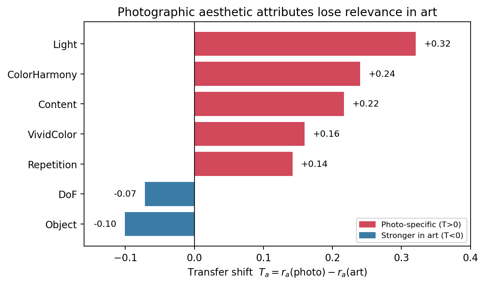
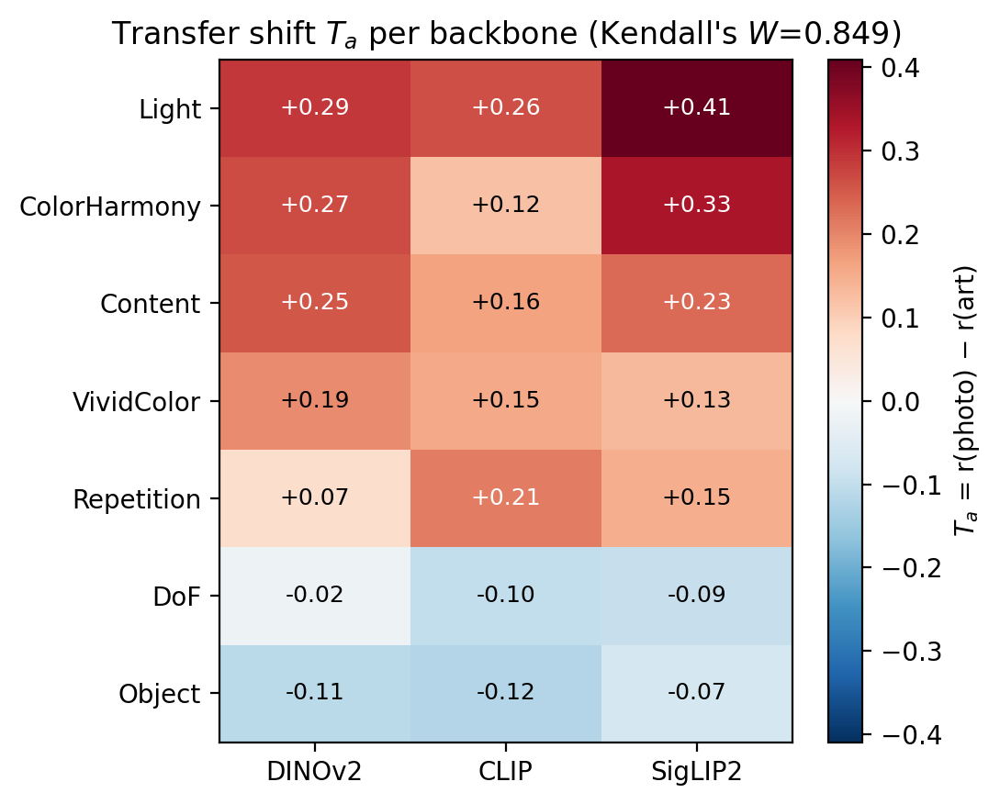
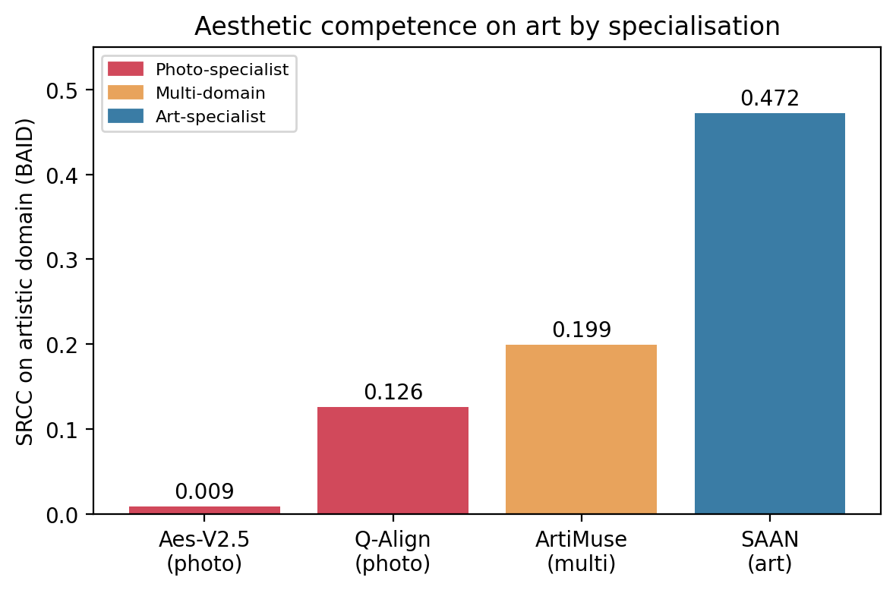

# 4. Experiments and Results

## 4.1 Experimental Setup

We evaluate on three aesthetic assessment datasets spanning two visual media. **AADB** [6] provides 8,458 / 500 / 1,000 (train / val / test) photographs, each annotated with an overall aesthetic score and eleven aesthetic attributes; it serves as the attribute source $\mathcal{D}_A$. **AVA** [3] supplies the photographic domain $\mathcal{D}_P$; following the standard `generic_test` split we sample 5,000 images (seed 42, fixed before any correlation was computed), of which 4,976 remain after accounting for images no longer hosted. **BAID** [4] supplies the artistic domain $\mathcal{D}_R$, with 6,394 test artworks after excluding 49 images (0.08%) unreachable from the original host; the excluded identifiers are logged for reproducibility. BAID is released under the CC BY-NC-ND 4.0 license and is used here for non-commercial academic research.

As frozen backbones $\varphi$ we deliberately span three distinct pretraining paradigms, drawn from the course's **Visual Intelligence** and **Multimodal Intelligence** modules: **DINOv2** ViT-B/14 [9], trained by self-supervision without any language signal; **CLIP** ViT-B/16 [1], trained by contrastive image-text alignment; and **SigLIP2** ViT-B/16 [2], a more recent vision-language encoder with a sigmoid contrastive objective and improved dense features. This spread is intentional: if a self-supervised encoder and two differently trained vision-language encoders agree on the transfer structure (Section 4.4), that structure cannot be attributed to any single pretraining signal. All three are used at base scale to control for capacity, so that any observed difference reflects representational family rather than model size. We extract the native pooled representation (768-d for all three) and never fine-tune the backbone: only a linear probe is fit on top, so that a successful read indicates the target axis is *already present* in the representation rather than *constructed* by the probe.

For every attribute $a$ we fit a ridge probe $g_a$ on $\mathcal{D}_A$ train features and evaluate with Spearman's rank correlation coefficient (SRCC). All decisions governing the analysis -- the readability threshold $\tau$, the unanimity rule, the feature definition, and the AVA sampling seed -- were registered before any gate, correlation, or gap value was observed.

## 4.2 Attribute Readability Gate

We first ask which of the eleven photographic attributes are linearly decodable from each frozen representation. An attribute is deemed **readable** only if its gate SRCC on $\mathcal{D}_A$ test reaches $\tau = 0.30$ for **all three** backbones; the unanimity rule fixes a common attribute support across backbones, which the later rank-agreement analysis (Section 4.4) requires.

Seven of eleven attributes pass (Table 1). The four that fail -- RuleOfThirds, Symmetry, BalancingElements, MotionBlur -- are the *spatial and compositional* attributes, whereas all seven survivors concern *color, tone, and content*. This is not an incidental threshold effect: a global pooled vector summarizes *what* is present in an image but discards *where* it is placed, so composition-dependent attributes are structurally harder to recover with a linear read. That even the failures are semantically coherent indicates the gate is measuring a real property of the representation rather than noise. A further regularity supports this reading: across all eleven attributes the minimum backbone in Table 1 is consistently DINOv2, the only purely self-supervised encoder, with the two vision-language encoders reading each attribute slightly better. The gap is small and never changes which side of the threshold an attribute falls on, but it is systematic, and it hints that language-aligned pretraining exposes nameable aesthetic attributes marginally more linearly -- a plausible consequence of these attributes having natural linguistic labels. Because our gate takes the minimum over backbones, the readable set is set by the most conservative encoder, making the seven-attribute support a lower bound rather than an optimistic one.

**Table 1.** Gate SRCC on AADB test ($\tau = 0.30$, unanimous across backbones). Bold = readable.

| Attribute | DINOv2 | CLIP | SigLIP2 | Verdict |
|---|---|---|---|---|
| **Object** | **0.668** | **0.706** | **0.710** | **readable** |
| **Content** | **0.585** | **0.642** | **0.655** | **readable** |
| **VividColor** | **0.525** | **0.692** | **0.684** | **readable** |
| **DoF** | **0.503** | **0.518** | **0.527** | **readable** |
| **ColorHarmony** | **0.438** | **0.492** | **0.476** | **readable** |
| **Light** | **0.367** | **0.457** | **0.487** | **readable** |
| **Repetition** | **0.353** | **0.402** | **0.387** | **readable** |
| BalancingElements | 0.266 | 0.284 | 0.296 | unreadable |
| RuleOfThirds | 0.248 | 0.263 | 0.252 | unreadable |
| Symmetry | 0.228 | 0.276 | 0.257 | unreadable |
| MotionBlur | 0.106 | 0.196 | 0.172 | unreadable |

## 4.3 Transfer Shift from Photography to Art

For each of the seven readable attributes we apply the photo-trained probe $g_a$ -- without any refitting -- to both domains and measure how well it explains the human aesthetic score in each. The transfer shift

```math
T_a = r_a(\mathcal{D}_P) - r_a(\mathcal{D}_R)
```

quantifies how much of an attribute's explanatory power is lost (or gained) when moving from photography to art, where $r_a(\mathcal{D}) = \mathrm{SRCC}(g_a(\varphi(\mathcal{D})),\ \text{score})$. Table 2 reports values averaged over the three backbones, with 95% bootstrap confidence intervals (2000 resamples); the final column gives the bootstrap probability of the opposite sign, and all seven shifts are significant at $p < 0.001$.

**Table 2.** Attribute correlation with aesthetic score in each domain, transfer shift, and 95% bootstrap CI. Positive $T$ = photo-specific; negative $T$ = stronger in art. All shifts significant ($p < 0.001$).

| Attribute | $r$ (photo) | $r$ (art) | $T$ = shift | 95% CI | $p$ |
|---|---|---|---|---|---|
| Light | 0.380 | 0.060 | **+0.320** | [+0.293, +0.347] | <0.001 |
| ColorHarmony | 0.226 | -0.014 | +0.240 | [+0.209, +0.270] | <0.001 |
| Content | 0.368 | 0.152 | +0.216 | [+0.188, +0.244] | <0.001 |
| VividColor | 0.179 | 0.019 | +0.158 | [+0.126, +0.189] | <0.001 |
| Repetition | 0.087 | -0.056 | +0.142 | [+0.112, +0.172] | <0.001 |
| DoF *(reversal)* | 0.112 | 0.183 | **-0.072** | [-0.102, -0.042] | <0.001 |
| Object *(reversal)* | 0.143 | 0.244 | **-0.102** | [-0.133, -0.069] | <0.001 |

Two patterns emerge. First, **five of seven attributes lose explanatory power in the artistic domain**, and the losses concentrate in the *color and tone* family: Light collapses from 0.38 to 0.06, and ColorHarmony and VividColor both fall to near-zero or negative correlation. Axes that characterize a good photograph -- balanced exposure, harmonious color, saturation -- do not characterize a good artwork; in several cases the correlation reverses sign, indicating that a direction learned as positive under photographic supervision runs *against* aesthetic quality in art.

Second, **two attributes reverse**: depth-of-field and object emphasis correlate more strongly with aesthetic quality in art than in photography. Their negative shifts are individually significant (Table 2), so the effect is not a threshold artifact. We report this observation here and defer its interpretation to the Discussion; we note only that it rules out a trivial "everything transfers worse" account -- the shift is attribute-dependent in both magnitude and direction. Figure 1 visualizes these shifts, making the split between the five photo-specific attributes (red) and the two art-preferred reversals (blue) immediately apparent. The magnitudes are also orderly: the largest positive shifts belong to the pure color-tone attributes (Light, ColorHarmony, VividColor), Content -- which carries semantic rather than purely photographic information -- shifts less, and the two reversals are the smallest in absolute value. The gradient from strongly photo-specific, through domain-general, to art-preferred is itself orderly rather than arbitrary.



**Figure 1.** Per-attribute transfer shift $T_a = r_a(\text{photo}) - r_a(\text{art})$ for the seven readable attributes, averaged over three backbones. Positive (red) bars mark photo-specific attributes; negative (blue) bars mark depth of field and object emphasis, more relevant in art.

## 4.4 Representation Invariance via Rank Agreement

A natural objection is that the shifts in Table 2 might be an artifact of one particular encoder. To test this we compute Kendall's coefficient of concordance $W$ [19] over the three backbones' rankings of $T_a$. We obtain $W = 0.849$; a permutation test (5,000 random per-backbone rankings) places this far above the null (mean 0.334) with $p = 0.001$, so the agreement is highly significant. Three encoders that differ in pretraining objective and vision-language grounding nonetheless order the seven attributes' transfer shifts almost identically. Sign agreement is in fact unanimous -- DoF and Object are negative under all three backbones, the remaining five positive under all three. The photo-to-art transfer structure is therefore a property of the *domain pair*, not of any single representation. Because the unanimity rule and the set of backbones were fixed in advance, this concordance is a genuine test rather than a post-hoc selection. The practical import is that a reader need not worry which encoder we happened to choose: had we run the study with any one of the three alone, the qualitative conclusion -- which attributes are photo-specific, which reverse -- would have been the same. Figure 2 shows the shift for each backbone separately; the three columns share an almost identical red-to-blue pattern, which is precisely what the high concordance coefficient quantifies.



**Figure 2.** Transfer shift $T_a$ per attribute (rows) and backbone (columns). The near-identical pattern across columns visualizes the rank agreement (Kendall's $W = 0.849$); sign is unanimous across backbones.

## 4.5 Model-Level Analysis: The Specialization Ladder

The probe analysis isolates individual attributes; we now ask whether the same photo-to-art gap appears at the level of complete, published aesthetic scorers. We assemble a grid of four models spanning the specialization spectrum and evaluate each on the artistic domain (BAID test): two photographic specialists -- **Q-Align** [14] and **Aesthetic-Predictor-V2.5** -- a multi-domain model, **ArtiMuse** [15] (trained on aesthetic data spanning photography, painting, design, and 3D), and an art specialist, **SAAN** [4], which we reproduce in-domain. Each model's art-domain SRCC carries a 95% bootstrap CI.

**Table 3.** Cross-domain aesthetic scoring. Photo columns are in-domain references; the art column (BAID) is the cross-domain test with 95% bootstrap CI. Ordering: photo-specialist < multi-domain < art-specialist.

| Model | Type | Photo (AVA) | Art (BAID) | 95% CI (art) |
|---|---|---|---|---|
| Aesthetic-Predictor-V2.5 | photo-specialist | 0.473 | 0.009 | [-0.013, 0.032] |
| Q-Align | photo-specialist | 0.817 | 0.126 | [0.102, 0.151] |
| **ArtiMuse** | **multi-domain** | 0.532 | **0.199** | [0.177, 0.223] |
| SAAN | art-specialist | -- | 0.472 | (in-domain) |

The grid yields a clean ordering on the artistic domain: the two photographic specialists score lowest (0.009 and 0.126), the multi-domain model recovers part of the gap (0.199), and the art specialist leads (0.472). The improvement from the best photographic specialist to the multi-domain model is statistically significant -- ArtiMuse exceeds Q-Align by a mean of +0.073, with $P(\text{ArtiMuse} \le \text{Q-Align}) < 0.001$ under a paired bootstrap and disjoint confidence intervals. The reading is twofold. Multi-domain training *does* partially recover artistic transfer relative to photo-only supervision, confirming that exposure to artistic data helps; yet the large remaining gap to the art specialist shows that broad multi-domain coverage is not a substitute for domain-specific adaptation. The absolute numbers sharpen the point. Q-Align is the strongest photographic model in the grid -- 0.817 on AVA, higher even than the art specialist's in-domain score -- yet on art it falls to 0.126, below a model (ArtiMuse) that is weaker on photographs but has seen artistic data. Raw photographic competence does not buy artistic competence; domain match does. Figure 3 makes the ladder visual: aesthetic competence on art rises monotonically with a model's exposure to artistic supervision, yet a substantial gap to the art specialist remains. We return to this in the Discussion, as it directly frames the target of a future domain-adaptation method.



**Figure 3.** Aesthetic scoring on the artistic domain (BAID) for four models ordered by specialization. Photographic specialists score lowest, the multi-domain model recovers part of the gap, the art specialist leads.

## 4.6 Coverage of Readable Attributes

The per-attribute shifts of Section 4.3 raise a system-level question: taken together, how much of each domain's predictable aesthetic signal do the readable attributes account for? We define coverage as the ratio $R^2_{\text{attr}} / R^2_{\text{full}}$, where $R^2_{\text{full}}$ regresses the aesthetic score on the full 768-d representation (the achievable ceiling for that encoder) and $R^2_{\text{attr}}$ regresses it on the seven readable-attribute predictions. The ratio normalizes away the differing ceilings of the two domains, a necessary correction since art aesthetics is intrinsically harder to predict ($R^2_{\text{full}} \approx 0.10$ for BAID vs. $0.45$ for AVA, consistent with SAAN's in-domain ceiling of 0.472 SRCC).

**Table 4.** Coverage of readable attributes, per domain (mean over three backbones, 95% bootstrap CI).

| Domain | $R^2_{\text{full}}$ | $R^2_{\text{attr}}$ | Coverage | 95% CI |
|---|---|---|---|---|
| Photography (AVA) | 0.455 | 0.208 | **0.450** | [0.420, 0.477] |
| Art (BAID) | 0.095 | 0.007 | **0.030** | [-0.150, 0.163] |

In photography, the readable attributes account for roughly **45%** of the aesthetic signal the representation can predict. In art, they account for **essentially none (3%)**: the art-domain confidence interval includes zero, so the attribute predictions explain no more of the artistic aesthetic score than a constant would. The photographic aesthetic vocabulary does not merely weaken in art attribute by attribute; as a system it collapses, covering almost none of what makes an artwork aesthetically strong. That the art-domain interval includes zero is telling: we cannot reject the hypothesis that, taken together, the photographic aesthetic attributes explain *nothing* about what makes an artwork aesthetically strong. Against photography's tight 0.45 interval [0.420, 0.477], this is a difference in kind, not degree, and it motivates domain-adaptive modeling that targets the artistic medium directly rather than hoping a photographic vocabulary will stretch to cover it.

## 4.7 Robustness Analysis (Ablation)

Because the readable set (Section 4.2) underlies every subsequent result, we verify that it does not depend on our pre-registered hyperparameters. We vary the ridge regularization $\lambda$ over two orders of magnitude and the gate threshold $\tau$ around its registered value.

**Table 5.** Sensitivity of the readable set to $\lambda$ and $\tau$. The set is invariant to $\lambda$ and stable across $\tau$; only at $\tau = 0.25$ does one borderline attribute (BalancingElements, min-SRCC 0.266) enter.

| Setting | Readable count | Change from baseline |
|---|---|---|
| $\lambda = 1$ ($\tau = 0.30$) | 7 | identical set |
| $\lambda = 10$ ($\tau = 0.30$) -- ours | 7 | baseline |
| $\lambda = 100$ ($\tau = 0.30$) | 7 | identical set |
| $\tau = 0.25$ ($\lambda = 10$) | 8 | + BalancingElements |
| $\tau = 0.30$ ($\lambda = 10$) -- ours | 7 | baseline |
| $\tau = 0.35$ ($\lambda = 10$) | 7 | identical set |

The readable set is invariant to $\lambda \in \{1, 10, 100\}$ and identical for $\tau \in \{0.30, 0.35\}$; only lowering the threshold to $\tau = 0.25$ admits a single borderline attribute. Our pre-registered choices therefore do not drive the qualitative result.